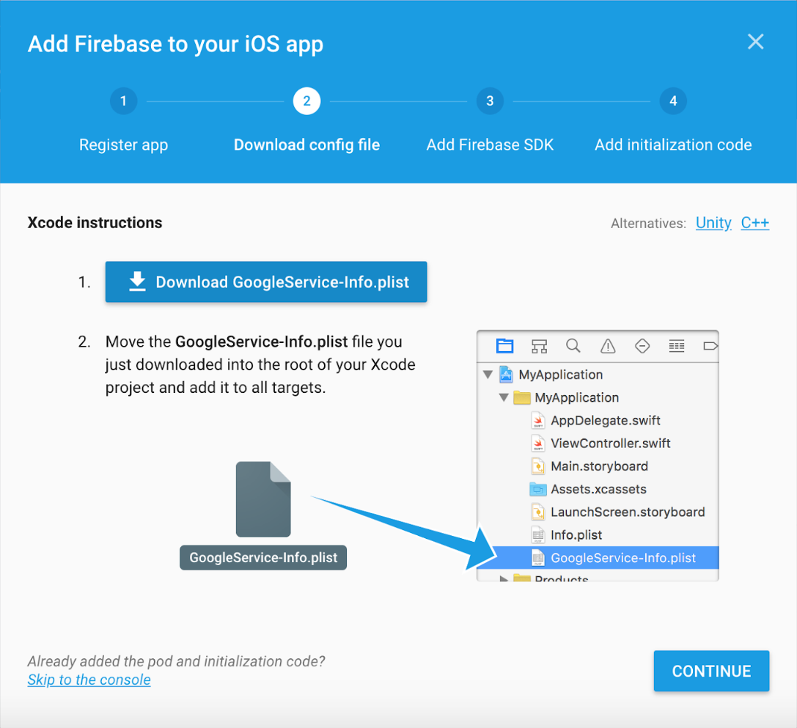
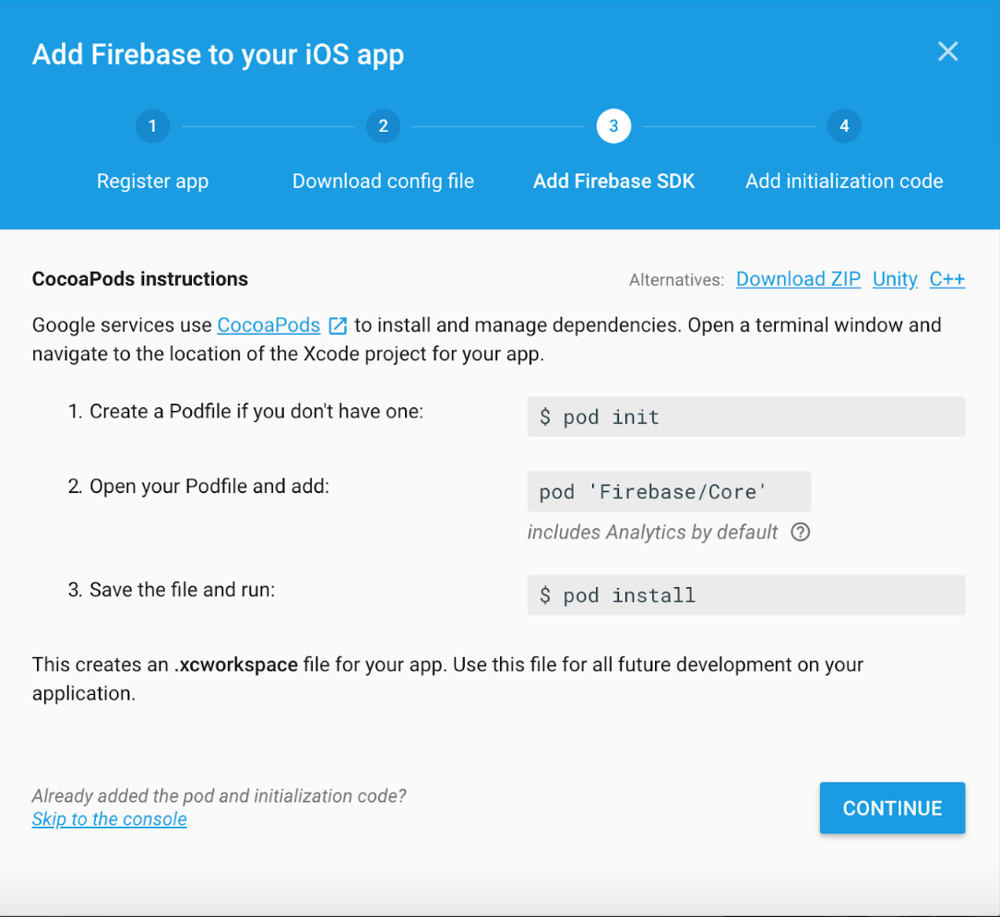

# SampleDevApp & CKTrends API

This repo is a playground of sorts containing the API code necessary for tracking the CloudKit database of "SampleDevApp."
The code of this repo was eventually turned into a Carthage library (also in this repo) to be used in your app in conjunction with the app CKTrends.

## Simplified version of how this works
1) Download the CKTrends API from the Carthage directory in this repo.
2) Add this framework to your own project. (Note: If you're using Cocoapods in your project, and Google Firebase is one of your
dependencies, this won't work.)
3) Follow the documentation below to prepare your project to use this API. Make the appropriate API calls using the documentation
below.
4) Get the CKTrends app by emailing cktrends1@gmail.com. (Unfortunately this app was rejected by the App Store because it was considered an "inappropriate" use of Apple's CloudKit database, as they considered my code to be "scraping" CloudKit. I can still distribute the app ad hoc, however.)
5) Follow the registration instructions in the CKTrends app (also below).
6) Tap "Refresh" in the CKTrends app to open your own app and invoke the API code. Return to the CKTrends app to view a bar
graph with your CloudKit trends!

# Step by step set up
This guide includes both the steps that you as a developer have to do, as well as the ones that I as the admin have to do. The ones
that you needn't worry about will be clearly marked as **ADMIN ONLY**.

## Get the CKTrends app
Email cktrends1@gmail.com to get the ad hoc version.

## APPLY via the CKTrends app
Open the CKTrends app, go to the My Apps tab, and tap APPLY. Fill out the form and tap Apply and send the email form that pops up. To find your "Bundle Identifier," go to the General tab in your Xcode project.

## **ADMIN ONLY** Manually process the email
1. Go to the Google Firebase dashboard, click Analytics App, and select "Add Another App." Go through the process.
2. Send the developer:
- The GoogleService-Info.plist file (or tell them how to alter the given plist file in this repo). (TODO)
- Send a UUID for appID (https://www.uuidgenerator.net/ - version 4 UUID)
- Add UUID as a ValidID in the production CloudKit database for CKTrends.

## Look for an email from cktrends1@gmail.com
- This email will contain a GoogleService-Info.plist file that you should add to the root of your Xcode project. Add this to all targets too.

- This email will also contain an ID for your app. Make note of this ID, as you'll need it in your API calls.

## Add Firebase to your project (TODO - manually instead of Cocoapods (just make sure that Firebase import in the API works); or maybe this won't be necessary becuase CKTrends already uses this API)
To your Cocoapods file, add the following under `# Pods for YourAppName`:
"Firebase/Core", "~>4.8.0"
"Firebase/Database", "~>4.8.0"
"Firebase/Auth", "~>4.8.0"

If your project is not already using Cocoapods, a dependency manager for iOS, you can learn more here:
- Installing Cocoapods: https://guides.cocoapods.org/using/getting-started.html
- Setting up dependencies using Cocoapods: https://guides.cocoapods.org/using/using-cocoapods.html

REMEMBER TO USE XCWORKSPACE AFTER RUNNING POD INSTALL FROM THE COMMAND LINE. (This is a peculiarity of Cocoapods. The first time you `pod install` your dependencies for a project,
Cocoapods generates an .xcworkspace file that you should use for development instead of the .xcproject.)

## Register a URL for your app

## REGISTER your app in CKTrends
Open the CKTrends app, go to the My Apps tab, and tap REGISTER. Fill out the form.
- App Name: The name you want to identify your app in CKTrends.
- Unique App ID: The ID in the email you received from cktrends1@gmail.com
- App URL:

