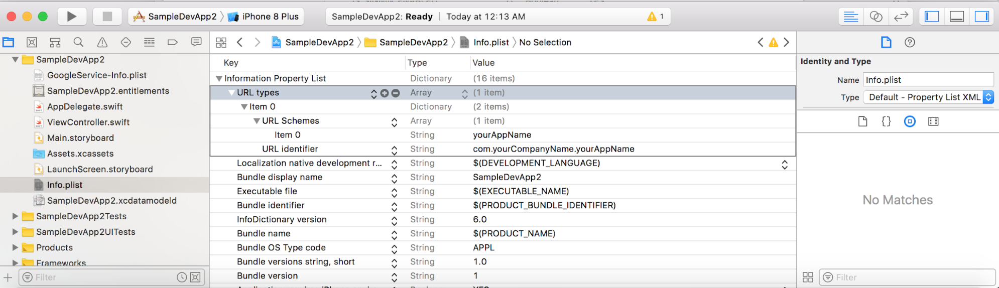

# SampleDevApp & CKTrends API

This repo is a playground of sorts containing the API code necessary for tracking the CloudKit database of "SampleDevApp."
The code of this repo was eventually turned into a Carthage library (also in this repo) to be used in your app in conjunction with the app CKTrends.

## Overview
1) Download the CKTrends API from the Carthage directory in this repo.
2) Add this framework to your own project. (Note: If you're using Cocoapods in your project, and Google Firebase is one of your
dependencies, this won't work.)
3) Follow the documentation below to prepare your project to use this API. Make the appropriate API calls using the documentation
below.
4) Get the CKTrends app by emailing cktrends1@gmail.com. (Unfortunately this app was rejected by the App Store because it was considered an "inappropriate" use of Apple's CloudKit database, as they considered my code to be "scraping" CloudKit. I can still distribute the app ad hoc, however.)
5) Follow the registration instructions in the CKTrends app (also below).
6) Tap "Refresh" in the CKTrends app to open your own app and invoke the API code. Return to the CKTrends app to view a bar
graph with your CloudKit trends!

# Step by step set up
This guide includes both the steps that you as a developer have to do, as well as the ones that I as the admin have to do. The ones
that you needn't worry about will be clearly marked as **ADMIN ONLY**.

## Get the CKTrends app
Email cktrends1@gmail.com to get the ad hoc version.

## APPLY via the CKTrends app
Open the CKTrends app, go to the My Apps tab, and tap APPLY. Fill out the form and tap Apply and send the email form that pops up. To find your "Bundle Identifier," go to the General tab in your Xcode project.

## **ADMIN ONLY** Manually process the email
1. Go to the Google Firebase dashboard, click Analytics App, and select "Add Another App." Go through the process.
2. Send the developer:
- The GoogleService-Info.plist file (or tell them how to alter the given plist file in this repo). (TODO)
- Send a UUID for appID (https://www.uuidgenerator.net/ - version 4 UUID)
- Add UUID as a ValidID in the production CloudKit database for CKTrends.

## Look for an email from cktrends1@gmail.com
- This email will contain a GoogleService-Info.plist file that you should add to the root of your Xcode project. Add this to all targets too.

- This email will also contain an ID for your app. Make note of this ID, as you'll need it in your API calls.

## Add Firebase to your project (TODO - manually instead of Cocoapods (just make sure that Firebase import in the API works); or maybe this won't be necessary becuase CKTrends already uses this API)
To your Cocoapods file, add the following under `# Pods for YourAppName`:

```
"Firebase/Core", "~>4.8.0"

"Firebase/Database", "~>4.8.0"

"Firebase/Auth", "~>4.8.0"
```


If your project is not already using Cocoapods, a dependency manager for iOS, you can learn more here:
- Installing Cocoapods: https://guides.cocoapods.org/using/getting-started.html
- Setting up dependencies using Cocoapods: https://guides.cocoapods.org/using/using-cocoapods.html

REMEMBER TO USE XCWORKSPACE AFTER RUNNING POD INSTALL FROM THE COMMAND LINE. (This is a peculiarity of Cocoapods. The first time you `pod install` your dependencies for a project,
Cocoapods generates an .xcworkspace file that you should use for development instead of the .xcproject.)

## Register a URL for your app (if you haven't already done this)
Ever wondered how apps are able to open other apps on your device? They use the local URL for that app! But this only works if that app has registered a local URL. CKTrends will open your app to run the API code in it when you tap "Refresh" in CKTrends. Your local URL will look something like this: `yourAppName://com.yourCompanyName.yourAppName`.

Open your project's Info.plist file, and add a `URL types` entry, making it look like the below screenshot. "yourCompanyName" is the name of your company or your own name. "yourAppName" is the name of
your app.



## REGISTER your app in CKTrends
Open the CKTrends app, go to the My Apps tab, and tap REGISTER. Fill out the form.
- App Name: The name you want to identify your app in CKTrends.
- Unique App ID: The ID in the email you received from cktrends1@gmail.com
- App URL: The URL you created in the previous step, which should be of the form `yourAppName://com.yourCompanyName.yourAppName`.

## Adjust CloudKit indices, if applicable

For every record type you want to track, make sure that

   - recordName is queryable
   
    - createdAt is sortable
    
    - createdAt is queryable
    
For every list type you want to track, make sure that

- recordName is queryable

These adjustments can be made in the CloudKit dashboard.

## Add the API call to your code
1. In your AppDelegate, import the CKTrends API: `import CKTrendsAPI`
2. Add this instance variable declaration to your AppDelegate: `var ckTrends: CKTrends?`
3. Initialize `ckTrends` in the `didFinishLaunchingWithOptions` method in your AppDelegate.
```
self.ckTrends = CKTrends(containerName: "CloudKitContainerYouWantToTrack", window: window!, appID: "AppIDThatWasEmailedToYou", recordTypesToTrack: RecordTypesToTrack, listsToTrack: ListsToTrack)
```
`containerName` will look something like `"iCloud.com.MarissaLeCoz.SampleDeveloperApp"`


`recordTypesToTrack` will look something like `["RecordTypeA", "RecordTypeB", ...]`

If you do not want to track any record types, this parameter should be `nil`.


`listsToTrack` will track the number of elements in a list property of some RecordType, assuming that only one instance of this RecordType exists. `listsToTrack` should be in the form:

`["RecordType1", "listProperty1", "RecordType2", "listProperty2", ...]`

If you do not want to track any record types, this parameter should be `nil`.


4. Add the following code to your AppDelegate. This code invokes the API when your app is opened by CKTrends.
```
func application(_ app: UIApplication, open url: URL, options: [UIApplicationOpenURLOptionsKey : Any] = [:]) -> Bool {
    ckTrends?.appWasOpened(options: options)
    return true
}
```

## Notes
- This API only tracks your Production CloudKit database. It will not track your Development CloudKit database.
- The User record type unfortunately can't be tracked because Apple does not let you query their built-in types.
- If you track a list length, the API assumes that only one instance of the record type that has that list has been created.


